# GCP Assignment (06-07-2025)


This repository contains a modular Terraform configuration for deploying a global, scalable infrastructure on **Google Cloud Platform (GCP)**. Key features include VPC networking, NAT routing, firewall rules, zonal MIGs, a global load balancer, autoscaling, and custom regional startup scripts.

---

## 📁 Project Structure

```bash
├── Screenshots/
│   ├── brazil.jpg
│   ├── firewalls.jpg
│   ├── health-check.jpg
│   ├── instance-groups.jpg
│   ├── instance-templates.jpg
│   ├── iowa.jpg
│   ├── italy.jpg
│   ├── lb-backend.jpg
│   ├── lb-frontend.jpg
│   ├── nats.jpg
│   ├── outputs.jpg
│   ├── routers.jpg
│   ├── subnets.jpg
│   ├── tf-lb-backend.jpg
│   ├── tf-lb-frontend.jpg
│   ├── tokyo.jpg
│   ├── vm-instances.jpg
├── .gitignore
├── 0-authentication.tf
├── 1-backend.tf
├── 2-vpc.tf
├── 3-subnets.tf
├── 4-router.tf
├── 5-nat.tf
├── 6-firewalls.tf
├── 7-lb.tf
├── 8-template.tf
├── 9-mig.tf
├── 10-autoscale-policy.tf
├── 11-outputs.tf
├── README.md
├── SC1-iowa.sh
├── SC2-italy.sh
├── SC3-brazil.sh
├── SC4-tokyo.sh
```

---

## 🧱 Terraform Modules and Resources

- `0-authentication.tf` - Sets up application credentials.
- `1-backend.tf` - Remote backend state configuration.
- `2-vpc.tf` - Creates the VPC network.
- `3-subnets.tf` - Defines subnets across Iowa, Brazil, Italy, and Tokyo.
- `4-router.tf` - Configures Cloud Router.
- `5-nat.tf` - Sets up Cloud NAT per region.
- `6-firewalls.tf` - Firewall rules using network tags.
- `7-lb.tf` - Global Load Balancer: URL map, backend service, and forwarding rule.
- `8-template.tf` - Instance templates with regional startup scripts.
- `9-mig.tf` - Managed Instance Groups (MIGs) per zone.
- `10-autoscale-policy.tf` - Zonal autoscaling using CPU utilization.
- `11-outputs.tf` - Outputs for MIG status, zones, and IPs.
- `SC1–SC4` - Startup scripts for each regional web server (Apache + metadata-based HTML).

---

## 🚀 Deployment Steps

```bash
gcloud auth application-default login
terraform init
terraform validate
terraform plan
terraform apply
```

---

## 📡 Load Balancer Architecture

The global external HTTP(S) Load Balancer (`tsa-gateway`) routes traffic based on a default URL rule (`/*`) to the `tsa-backend-service`. Each backend points to a MIG in:

- `us-central1-a` (Iowa)
- `southamerica-east1-b` (Brazil)
- `europe-west8-b` (Italy)
- `asia-northeast1-a` (Tokyo)


---

## 🌍 Region Scripts (Apache Startup)

Each script configures Apache, injects regional metadata into the web page, and applies a themed background.

- `SC1-iowa.sh`  
- `SC2-italy.sh`  
- `SC3-brazil.sh`  
- `SC4-tokyo.sh`  

---

## 📸 Screenshots

Below are visual confirmations of successful deployment across key GCP services:

### 🔧 Infrastructure

- **Subnets**  
  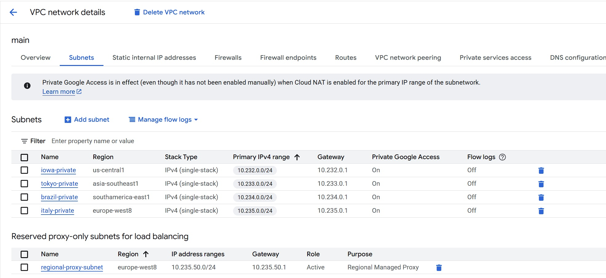

- **Routers & NAT**  
  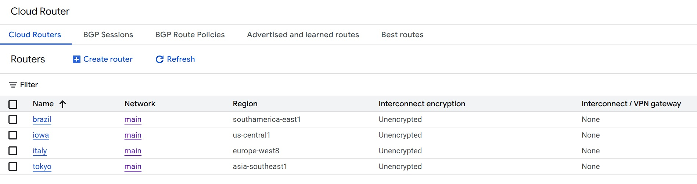  
  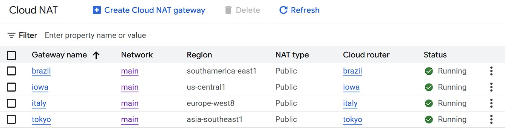

- **Firewalls**  
  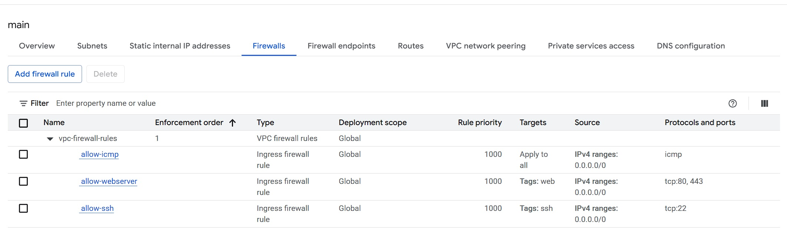

---

### 🖥️ Compute Resources

- **Instance Templates**  
  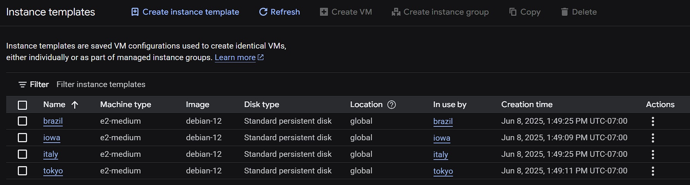

- **Instance Groups (MIGs)**  
  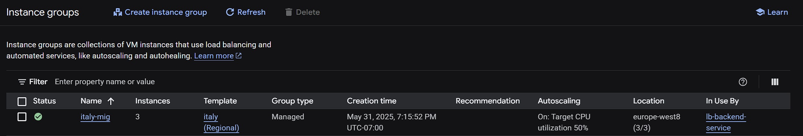

- **VM Instances**  
  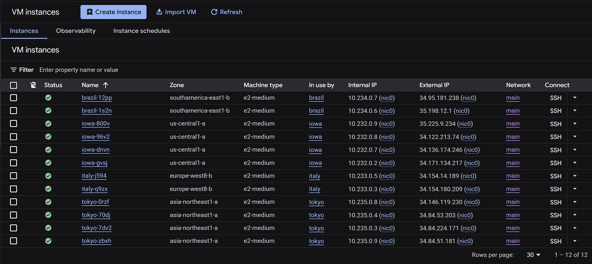

---

### ❤️ Health Check

- 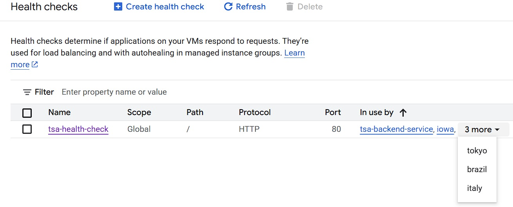

---

### 🌐 Load Balancer

- **Frontend Configuration**  
  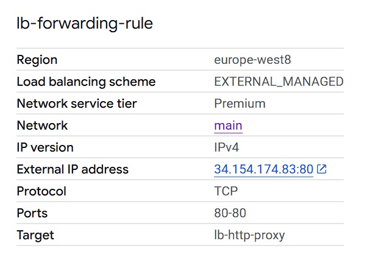

- **Terraform Frontend Resource View**  
  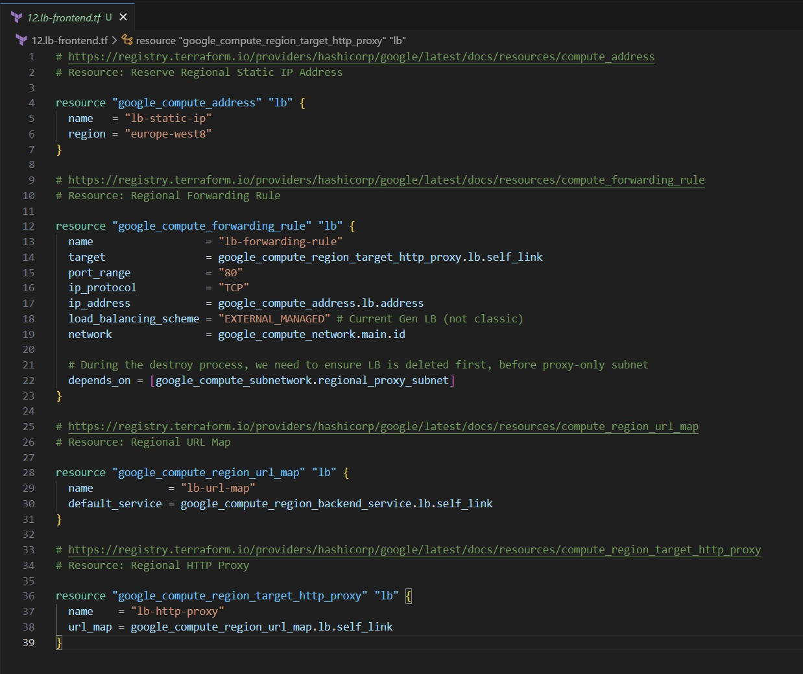

- **Backend Configuration**  
  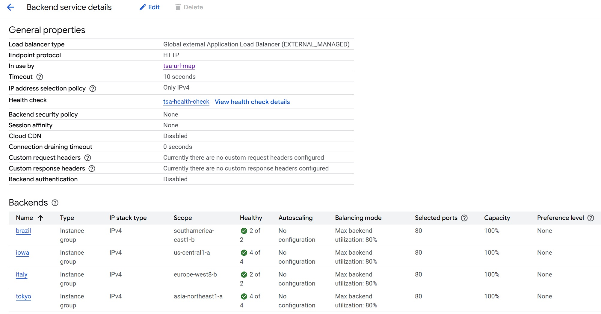

- **Terraform Backend Resource View**  
  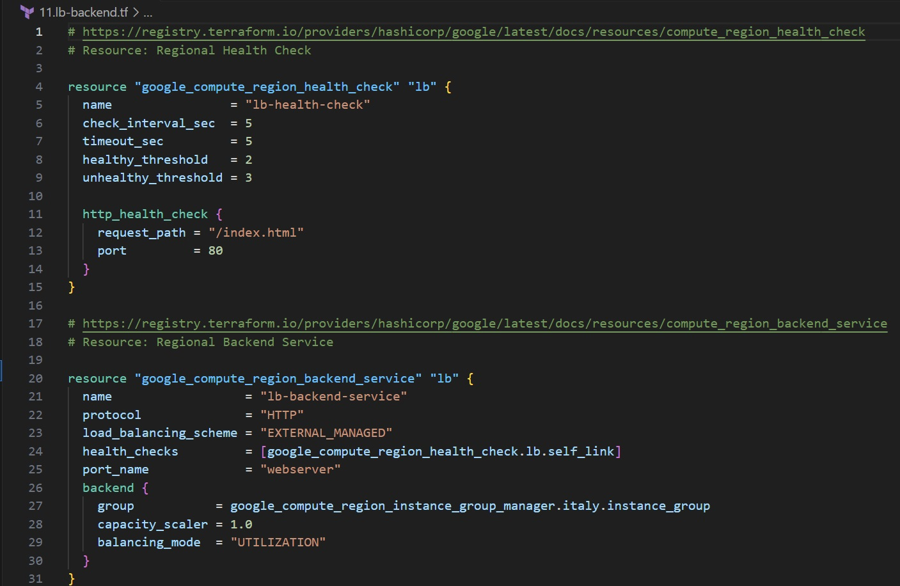

---

### 🧪 Output & Tests

- **Outputs from Terraform**  
  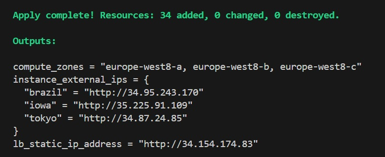

- **Regional Startup Page - Iowa**  
  

- **Regional Startup Page - Italy**  
    

- **Regional Startup Page - Brazil**  
  

- **Regional Startup Page - Tokyo**  
  

---

## 🔧 Troubleshooting & Optimization

- Ensure equal backend weights with `capacity_scaler = 1.0`
- Use consistent health check settings for all MIGs
- Monitor URL Map in GCP for traffic flow insights
- Cache settings may bias region selection (e.g., `SERVED_FROM_CACHE`)

---

## 🧹 Cleanup

```bash
terraform destroy -auto-approve
```

---

## 🧠 Notes

- Load balancer is **global**, leveraging GCP’s external HTTP LB.
- Startup scripts generate dynamic HTML based on region.
- Autoscaling is configured for 10% CPU target and even distribution.

---

## 📚 References

- [Terraform GCP Provider](https://registry.terraform.io/providers/hashicorp/google/latest/docs)
- [Google Load Balancing](https://cloud.google.com/load-balancing/docs)
- [GCP Metadata Server](https://cloud.google.com/compute/docs/storing-retrieving-metadata)

---

## 👤 Author

T.I.Q.S. – Class 6.0
