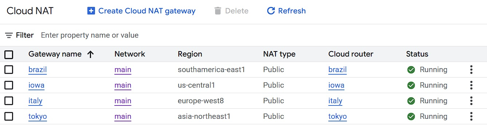

# GCP Assignment (05-31-2025)


This repository contains a modular, scalable Terraform configuration for deploying a fully operational infrastructure on **Google Cloud Platform (GCP)**. The deployment spans **VPC setup, NAT routing, firewall rules, managed instance groups, load balancing, autoscaling policies, and startup scripts for regional instances.**

## 📁 Project Structure

```bash
├── Screenshots/
│   ├── brazil.jpg
│   ├── firewalls.jpg
│   ├── health-checks.jpg
│   ├── instance-groups.jpg
│   ├── instance-templates.jpg
│   ├── iowa.jpg
│   ├── italy1.jpg
│   ├── italy2.jpg
│   ├── italy3.jpg
│   ├── lb-backend.jpg
│   ├── lb-frontend.jpg
│   ├── load-balancer.jpg
│   ├── nats.jpg
│   ├── outputs.jpg
│   ├── routers.jpg
│   ├── subnets.jpg
│   ├── tf-lb-backend.jpg
│   ├── tf-lb-frontend.jpg
│   ├── tf-outputs.jpg
│   ├── tokyo.jpg
│   ├── vm-instances.jpg
├── .gitignore
├── 0-authentication.tf
├── 1-backend.tf
├── 2-vpc.tf
├── 3-subnets.tf
├── 4-router.tf
├── 5-nat.tf
├── 6-firewalls.tf
├── 7a-compute.tf
├── 7b-template.tf
├── 8-health-check.tf
├── 9-mig.tf
├── 10-autoscale-policy.tf
├── 11.lb-backend.tf
├── 12.lb-frontend.tf
├── AA-outputs.tf
├── brazil.sh
├── iowa.sh
├── italy.sh
├── README.md
├── tokyo.sh
```

---

## 🧱 Terraform Modules and Resources

- `.gitignore` – 🚫 Prevents sensitive files and state data from being committed.
- `0-authentication.tf` - 🔐 Service account credentials setup using `GOOGLE_APPLICATION_CREDENTIALS`.
- `1-backend.tf` - 💾 Remote state backend configuration.
- `2-vpc.tf` - 🌐 VPC creation.
- `3-subnets.tf` - 🌍 Subnetworks for different regions (Iowa, Brazil, Tokyo, and Italy).
- `4-router.tf` - 🔁 Cloud Router setup for NAT.
- `5-nat.tf` - 🌐 Cloud NAT for each region.
- `6-firewalls.tf` - 🔥 Tag-based firewall rules:
  - RDP access (Windows)
  - SSH access (Linux)
  - HTTP/HTTPS access (web server)
- `7a-compute.tf` / `7b-template.tf` - 🖥️ VM instances and Instance Templates:
  - Linux machines `iowa`, `tokyo`, and `brazil`
  - Region-specific tagging
  - Italy Instance Template for Load Balancer
- `8-health-check.tf` - ❤️ HTTP health checks for MIG.
- `9-mig.tf` - 🧬 Managed Instance Groups:
  - Autoscaling enabled
  - Configured per region
- `10-autoscale-policy.tf` - 📈 Autoscaling policy definition.
- `11.lb-backend.tf` - 🔄 Backend services for Load Balancer.
- `12.lb-frontend.tf` - 🌐 HTTP global forwarding rule (external load balancer).
- `AA-outputs.tf` - 📤 Useful outputs like IP addresses and URLs.

---

## 🚀 Deployment Instructions

```bash
gcloud auth application-default login
terraform init
terraform fmt
terraform validate
terraform plan
terraform apply
```

---

## 📸 Show Your Work

> Theses screenshots will show the **GCP infrastructure** setup and **Terraform** examples for this project.

### Subnets and Firewalls


### Cloud NAT and Routers




### Instances: VM Instances, Instance Template, and MIG


### Health Checks


### Load Balancer Setup

- **Load Balancer** 
- **Load Balancer Backend Services**
  - **Console** 
  - **Terraform** 
- **Load Balancer Frontend Services**
  - **Console**
    - 
  - **Terraform** 

---

## 📦 Terraform Outputs


---

## 🔧 Outputs Scripts

- `brazil.sh`: Configures the Brazilian Linux web server.

- `iowa.sh`: Configures the Iowa Linux web server.

- `tokyo.sh`: Configures the Tokyo Linux web server.

- `italy.sh`: Configures the Italy MIG for the LB web server across all compute zones.
  - `europe-west8-a`: 
  - `europe-west8-b`: 
  - `europe-west8-c`: 

---

## 🧹 Cleanup

To tear down the infrastructure:

```bash
terraform destroy -auto-approve
```

---

## 🧠 Notes

- All VM instances are deployed across three regions to test global load balancing and NAT traversal.
- Firewalls are tightly scoped using tags for security.
- Load balancer uses MIGs and health checks for fault tolerance.

---

## 🔗 References

- [Terraform GCP Provider Docs](https://registry.terraform.io/providers/hashicorp/google/latest/docs)
- [Google Cloud NAT](https://cloud.google.com/nat/docs/overview)
- [Google Load Balancing](https://cloud.google.com/load-balancing)

---

## Author

- **T.I.Q.S.** - *Class 6.0*
